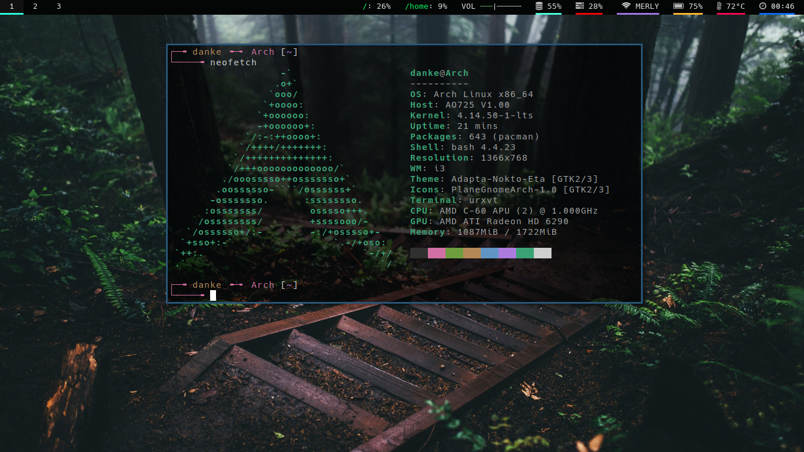

# Archrice

These are my config file. I make this repo because i was inspired by [luke smith](https://www.github.com/lukesmithxyz). He's the one reason why i'm starting to use i3 as my Go-to DE (Desktop Environment).

This ricing setup will **work** on any Linux distro, so you don't need to install Arch as long as you have i3wm installed.

## Programs that i bind are listed in here:
* ncmpcpp & mpd.
* urxvt (rxvt-unicode).
* vim.
* newsboat.
* polybar.
* rofi.
* mpd.
* neofetch.
* [betterlockscreen](https://github.com/pavanjadhaw/betterlockscreen).
* And many more!

## Like my rice?
You can push that star button if you find it awesome!, Also check this [guy](https://www.github.com/lukesmithxyz) out! Without him, i might not create this cool Repo.

## Extra Information:
The program that i use, might get changed. Also you need to edit it later, Just to make sure anything works fine. And also, feel free to add other suggestion. And i may implement them

