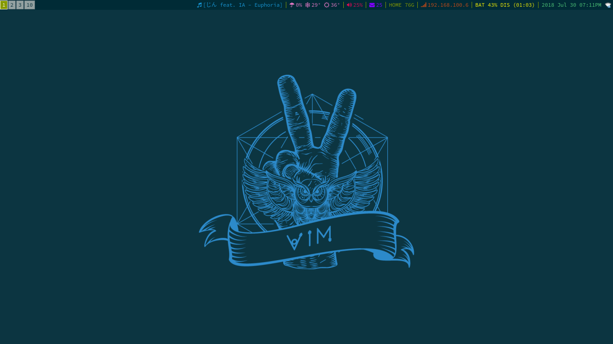
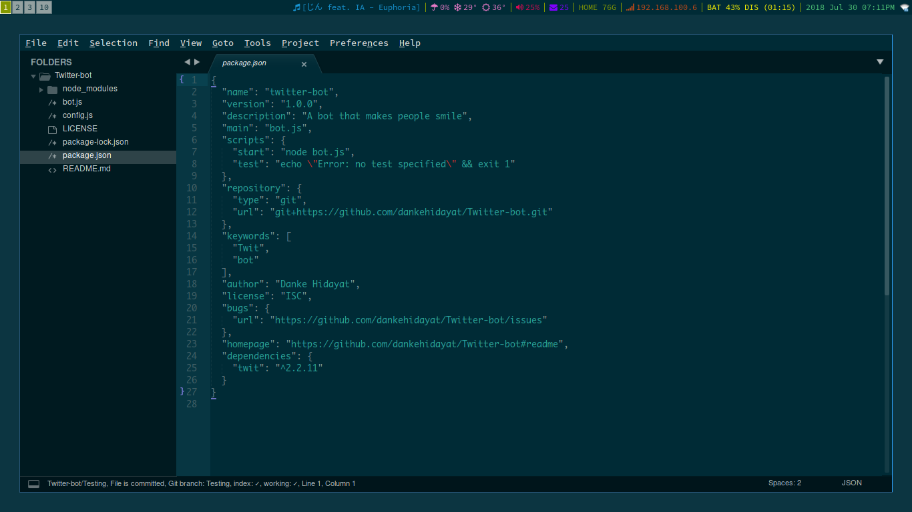
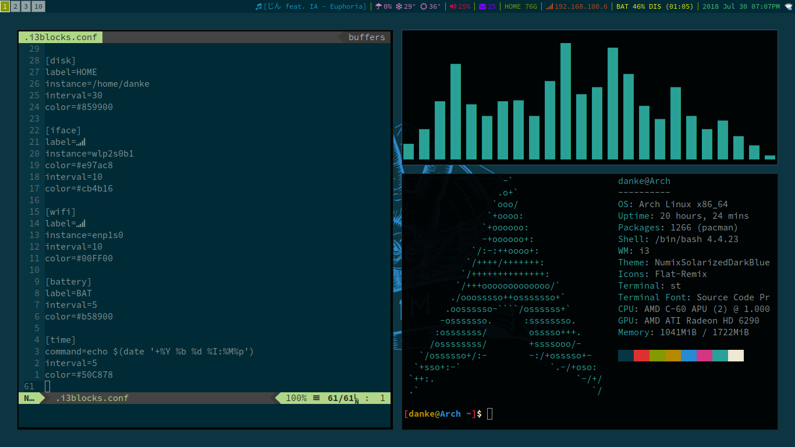

# Archrice

These are my config file. I make this repo because i was inspired by [luke smith](https://www.github.com/lukesmithxyz). He's the one reason why i'm starting to use i3 as my Go-to DE (Desktop Environment).

This ricing setup will **work** on any Linux distro, so you don't need to install Arch as long as you have i3wm installed.

## Dependencies
### Programs
* ncmpcpp.
* mpd.
* neomutt.
* calcurse.
* dmenu.
* [pywal](https://github.com/dylanaraps/pywal/).
* ~~urxvt~~
* st (Default Terminal)
* vim.
* [rtv](https://github.com/michael-lazar/rtv).
* newsboat.
* i3blocks (Minimal memory usage than Polybar)
* neofetch.
* [betterlockscreen](https://github.com/pavanjadhaw/betterlockscreen).
* [i3 Gaps](https://github.com/Airblader/i3).

## Like my rice?
Click the star button if you find it Awesome!, Also check this cool [guy](https://www.github.com/lukesmithxyz).
## Additional Notes:
Feel free to make pull request as i may implement them, if it's fit with the setup.
