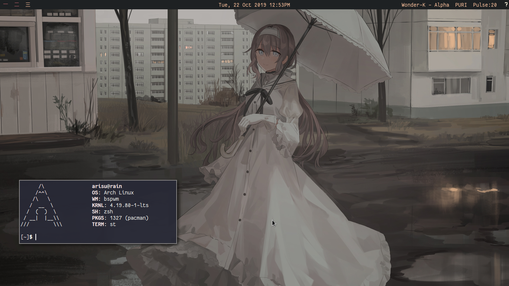

My i3-gaps dotfiles, setup theme might changes from time to time. This repos was archived for quite sometimes but i reopened this
again.

### Softwares:
Software list
- st - suckless terminal
- rtv - ncurses reddit in terminal
- i3-gaps - the tiling window manager with gaps
- mpd and ncmpcpp - the daemon and the music player
- mpv - mplayer based program
- neofetch - displaying basic machine information
- newsboat - rss reader
- polybar (That awesome bar)
- qutebrowser - webkit based browser (Rarely used this)
- ranger and nnn - for file manager
- zathura - pdf viewer
- calcurse - ncurses calendar
- neomutt for email client
- dmenu - suckless app launcher
- betterlockscreen - i3lock but better
- ~~compton~~ xcompmgr - minimalist touch

### Scripts:
I create some scripts by own and some other [scripts](./.scripts) belong to [Luke Smith](https://www.github.com/lukesmithxyz) and other people i can't tell it's name.

### License:
This dotfiles are MIT licensed. See below
[License](./LICENSE).
