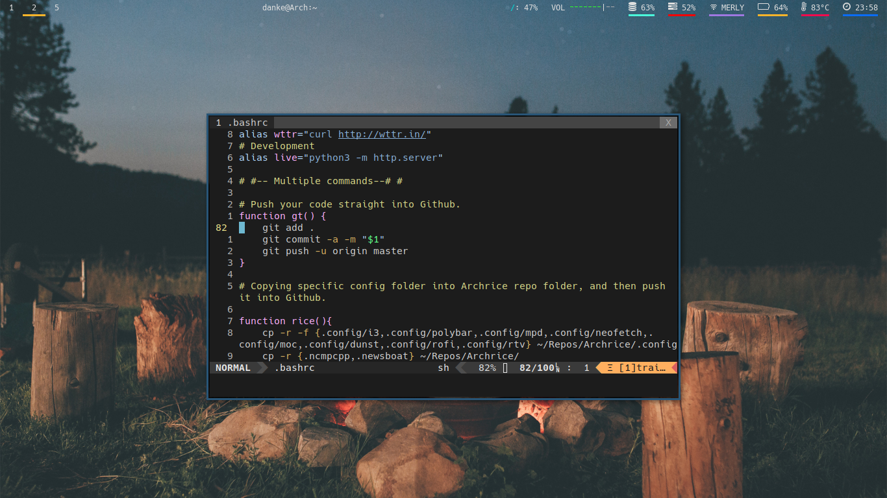
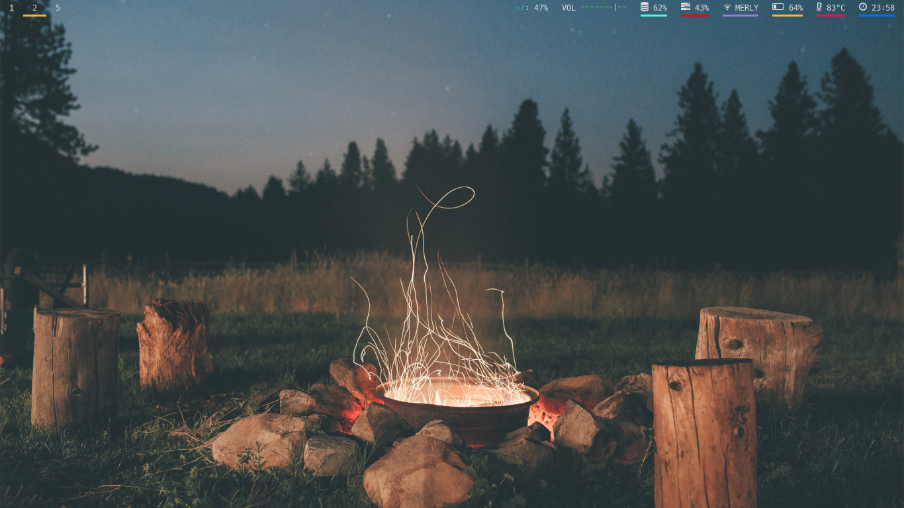

# Archrice

These are my config file. I make this repo because i was inspired by [luke smith](https://www.github.com/lukesmithxyz). He's the one reason why i'm starting to use i3 as my Go-to DE (Desktop Environment).

This ricing setup will **work** on any Linux distro, so you don't need to install Arch as long as you have i3wm installed.

## Dependencies
### Programs
* ncmpcpp.
* mpd.
* neomutt.
* calcurse.
* dmenu.
* [pywal](https://github.com/dylanaraps/pywal/).
* urxvt (Default Terminal).
* vim.
* [rtv](https://github.com/michael-lazar/rtv).
* newsboat.
* [polybar](https://github.com/jaagr/polybar).
* rofi.
* neofetch.
* [betterlockscreen](https://github.com/pavanjadhaw/betterlockscreen).
* [i3 Gaps](https://github.com/Airblader/i3).
### Other
#### Fonts:
* [Hack](https://github.com/source-foundry/Hack).
* [Source Code Pro](https://typekit.com/fonts/source-code-pro).
* [Roboto](https://github.com/google/roboto).
* [Meslo](https://github.com/andreberg/Meslo-Font).
* [Monaco](https://github.com/cstrap/monaco-font)
* [Comfortaa](https://www.dafont.com/comfortaa.font)
* [Anka/Coder](https://fontlibrary.org/en/font/anka-coder)
#### GTKs:
* [Adapta Nokto](https://github.com/adapta-project/adapta-gtk-theme)
* [Matcha Dark Azul](https://www.opendesktop.org/c/1502781869)
* [Arc](https://github.com/horst3180/Arc-theme)
#### Icons:
* [Plane](https://www.opendesktop.org/c/1499721142) 
* [Flat Remix](https://www.gnome-look.org/p/1012430/)
* [Papirus](https://www.opendesktop.org/p/1166289/)
## Like my rice?
Click the star button if you find it Awesome!, Also check this cool [guy](https://www.github.com/lukesmithxyz).
## Additional Notes:
Feel free to make pull request as i may implement them, if it's fit with the setup.
