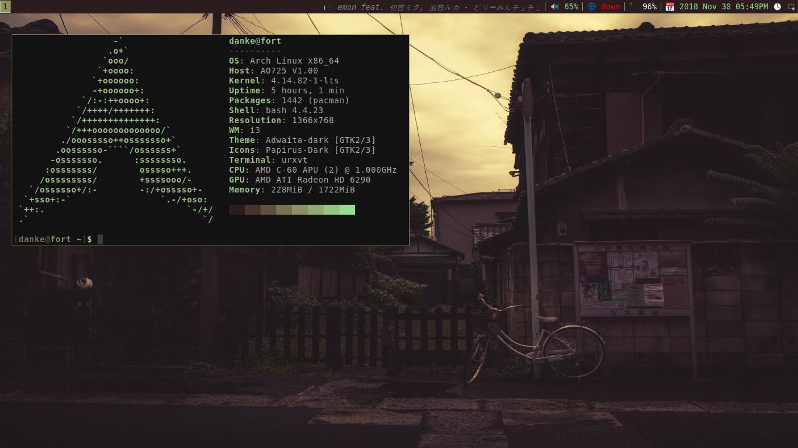

# Archrice

These are my config file. I make this repo because i was inspired by [Luke Smith](https://www.github.com/lukesmithxyz).
This ricing setup should **work** on any Arch based distro. Some packages might
be available on Debian aswell (Haven't check it out).

## Programs
List of the programs:
* st
* urxvt (Default terminal)
* i3-gaps
* i3blocks
* mpd and ncmpcpp
* mpv
* neofetch
* newsboat
* polybar
* qutebrowser
* ranger
* zathura
* calcurse
* mutt/neomutt
* dmenu
* betterlockscreen
* compton

## Scripts
Most of the [scripts](./.scripts) belong to [Luke Smith](https://www.github.com/lukesmithxyz).
Some scripts i rewrote a bit. (Because some scripts didn't worked on mine)

## License
[MIT License](./LICENSE)
